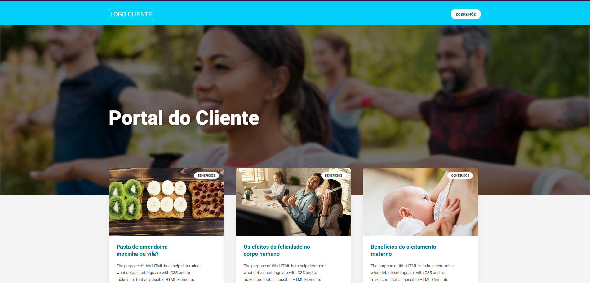
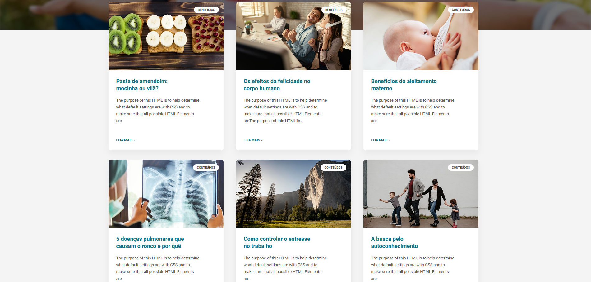
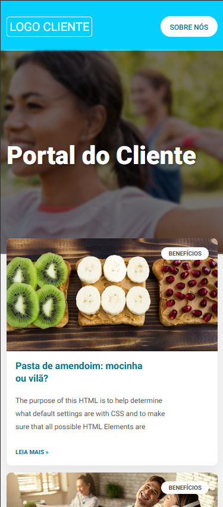
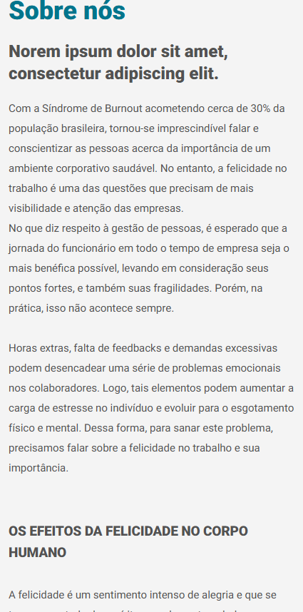
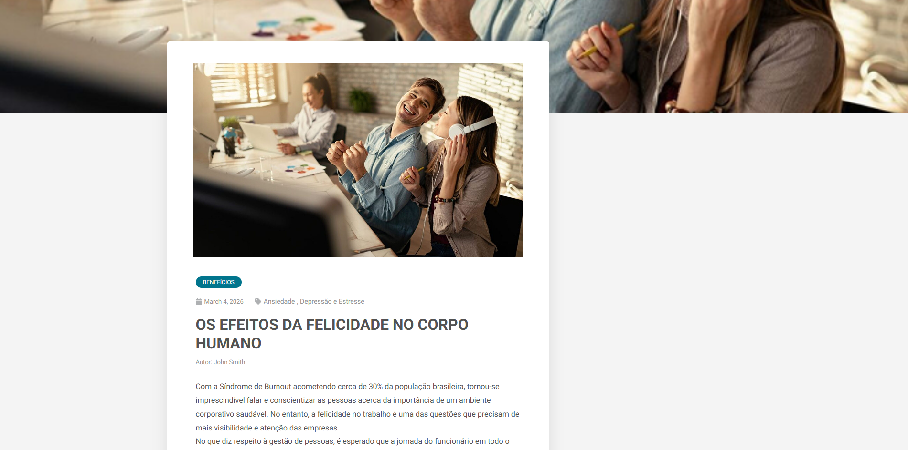

# Action Labs - WordPress Theme Test

Desenvolvimento de um tema WordPress personalizado construído a partir de um layout do Figma, focando em responsividade, qualidade de código e uso de funções padrão do WordPress.

## 🎯 Escopo do Projeto

O objetivo deste teste foi criar um tema que atenda aos seguintes requisitos da Action Labs:
- Implementação fiel ao layout desktop fornecido no Figma.
- Criação e adaptação completa de responsividade para dispositivos móveis (Mobile First & Adaptive).
- Template de Homepage exibindo:
    - Custom Hero content.
    - Grid com os 6 últimos posts (Thumbnail, categoria, título e resumo).
- Template de Post Único (`single.php`).
- Template de Página ("Sobre Nós").
- Header com menu de navegação e Footer com informações de copyright.

## 🚀 Tecnologias e Boas Práticas

- **WordPress:** Uso de funções padrão (Template Hierarchy, Enqueue Scripts, WP_Query).
- **CSS3:** Arquitetura limpa dividida em seções lógicas, CSS Grid, Flexbox e variáveis (`:root`).
- **Responsividade:** Media queries graduais (1024px, 768px, 600px, 425px, 375px, 320px) garantindo fluidez sem uso excessivo de `!important`.
- **Performance:** Carregamento otimizado de fontes Google (Roboto).
- **Gutenberg Ready:** Suporte ativado para o editor de blocos nativo do WordPress.

## 📸 Screenshots

Aqui estão algumas prévias de como o layout se comporta em diferentes telas (Desktop e Mobile):

### Homepage - Desktop & Mobile
| Desktop (1200px+) | Desktop | Mobile (375px) |
| :---: | :---: | :---: |
|  |  |  |

### Sobre Nós & Single Post
| Página Sobre (Mobile) | Single Post (Desktop) |
| :---: | :---: |
|  | |

## ⚙️ Como Instalar e Testar

1. Clone ou baixe este repositório.
2. Extraia a pasta `actionlabstheme` dentro do diretório `/wp-content/themes/` da sua instalação local do WordPress.
3. Acesse o painel de administração (`/wp-admin`), vá em **Aparência > Temas** e ative o **Action Labs Theme**.
4. Certifique-se de configurar um Menu em **Aparência > Menus** e garanta que existem posts cadastrados com Imagem Destacada para visualizar o layout da home corretamente.

---
*Teste desenvolvido para o processo seletivo da Action Labs.*
